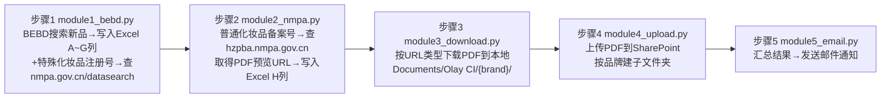

# CI New SKU Tracker — 技术架构 / Architecture（附件）

## 技术栈 Tech Stack

| 用途 | 技术选型 |
|---|---|
| 语言 | Python 3.11 |
| 看板前端 | Streamlit（`src/dashboard.py`），自定义 HTML/CSS/JS 通过 `st.iframe` 渲染月历视图 |
| 网页自动化抓取 | Playwright（sync API）驱动 Chromium，访问 BEBD / NMPA 网站 |
| Excel 读写 | openpyxl |
| PDF 处理 | PyMuPDF (`fitz`)：提取文本、渲染首页缩略图 |
| 滑块验证码识别 | 优先 ddddocr（本地免费OCR）→ 失败退回超级鹰(Chaojiying，付费打码平台) → 最后兜底人工手动在浏览器里完成 |
| 看板管理员认证 | 标准库 `hashlib` PBKDF2-HMAC-SHA256（20万轮）+ 随机16字节盐，本地 JSON 存储（`src/auth.py`），不依赖公司SSO |
| SharePoint 上传 | `extend/python/office365`（Office365-REST-Python-Client）+ MSAL，Azure AD App Registration Client Credentials 流程 |
| 邮件发送 | 优先 Outlook COM（`win32com`，需本机装并登录Outlook）→ 失败退回 Microsoft Graph API（同一 Azure AD App） |
| 任务调度 | Windows Task Scheduler，`scripts/setup_monthly_task.ps1` 一次性注册月度任务 |
| 版本控制 | Git + GitHub，SSH 部署密钥（`~/.ssh/config` 里 `github-zitaxvvv` host别名） |

## 模块设计 / 数据流 Data Flow

`main.py` 按顺序编排 5 个步骤模块（每步可用 `--step N` 单独运行、`--from-step N` 从某步继续）：

- `dashboard.py` 是独立的只读展示层 + 管理面板，直接读取同一份 `CI_List_Ada.xlsx`；管理员点击"立即触发抓取"本质是 `subprocess.Popen` 调用 `main.py`，不是重新实现一套抓取逻辑。
- 备案/注册号关键字分类规则（决定查哪个网站）：
  - 含"特" → 特殊化妆品注册 → `nmpa.gov.cn/datasearch`
  - 含"备" → 普通化妆品备案 → `hzpba.nmpa.gov.cn`
  - 含"进" → 进口（在以上两个网站内分别选进口页面）

## 设计取舍 Design Decisions

- **为什么日历用 iframe+原生HTML而不是纯Streamlit组件**：需要支持把产品卡片拖拽到悬浮层做成分对比，Streamlit 原生组件难以实现跨卡片拖拽事件，所以自建一段 HTML/JS 嵌入 `st.iframe`。
- **为什么数据增/删/改的备份用简单文件复制而非数据库**：数据量小、修改频率低（管理员偶尔手动纠错），`openpyxl` + `shutil.copy2` 最简单可靠，管理员也能直接打开 Excel 人工核对/恢复，不需要额外运维一套数据库。
- **为什么管理员认证不对接公司 SSO**：服务器上没有现成的 SSO 对接方案，管理员数量少（几人级别），本地 PBKDF2 加盐哈希对这个规模已经足够安全，且实现和维护成本最低。
- **为什么抓取脚本设计成可拆分步骤（`--step`/`--from-step`/`--resume`）**：抓取过程涉及多个可能失败的外部依赖（网站改版、验证码、WAF拦截），拆分后某一步失败可以单独重跑，不用从头再来。

## 已知限制 Known Limitations

1. **NMPA/hzpba 政府网站 WAF 拦截**（2026-07-23起观测到）：`www.nmpa.gov.cn/datasearch` 和 `hzpba.nmpa.gov.cn` 对所有自动化访问方式（requests / headless Playwright / headed Playwright）均返回 400/412 空响应，响应头带阿里云WAF反爬标识（`acw_tc` cookie）。已通过对照组网站（bebd.bevol.com 同时段访问正常）确认这是网站主动拦截，不是通用网络问题。**不建议尝试指纹伪装/代理轮换等绕过手段**——这类政府监管网站的反爬拦截应被视为访问边界，绕过存在合规风险。
2. **BEBD 登录依赖人工介入**：无法完全自动化登录（账号密码或扫码），Cookie 过期后无人值守的计划任务会卡住直到超时。目前没有更好的自动化方案，只能靠管理员定期人工检查/刷新登录状态。
3. **Streamlit 没有开机自启机制**：目前只有"抓取流程"通过 Task Scheduler 每月自动运行，看板本身（`streamlit run`）需要管理员手动启动，服务器重启后需要重新执行一次。如需要，可以额外加一个"开机自启"的计划任务触发器来解决。
4. **`src/config.py` 里的 Azure AD Client Secret 是明文硬编码**，且已被提交进 Git 仓库历史。这是当前架构里最需要优先修复的安全问题：建议尽快在 Azure 门户重置该 secret，并改造为从环境变量或本地不进git的配置文件读取，避免旧 secret 一旦泄露被长期滥用。

## 数据保护 Backup Safety Net

- 管理员通过看板面板做的每一次编辑/删除/新增，都会先自动复制一份当前 Excel 到 `Documents\Olay CI\_admin_backups\`（保留最近30份，自动清理更旧的），误操作可以直接从这个目录手动恢复。
- `src/_clean_pipeline_data.py`（一次性维护脚本，非计划任务的一部分）在删除数据前也会自动备份到同一Excel所在目录，命名格式 `CI_List_Ada_backup_<时间戳>.xlsx`。
